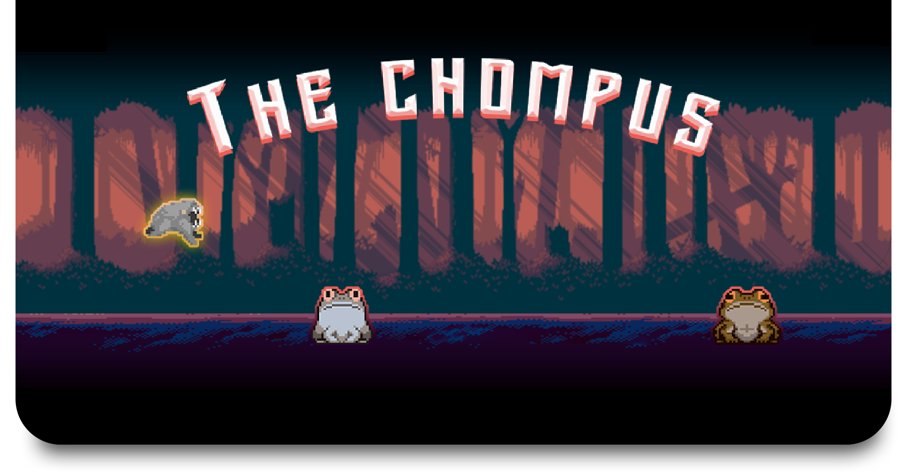

[The Chompus](https://evgeny-rov.github.io/the-chompus-game/) is a 2D Endless Runner Web JS game inspired by
Google Chrome T-Rex Game.
  - Made with Phaser Framework, Webpack and Workbox.
  - Progressive Web App (PWA).
  - Cross-platform.
  - Installable.
## Try it out
Latest version hosted on GitHub Pages: [The Chompus](https://evgeny-rov.github.io/the-chompus-game/).
Try it on mobile, works even better.
## Setup locally
```
$ git clone https://github.com/evgeny-rov/the-chompus-game.git
$ npm install
```
Build project and open web server running project:
```
$ npm run start
```
Builds code bundle with production settings:
```
$ npm run build
```
## Game assets
 - Player sprite by https://twitter.com/saint11
 - Parallax Background by https://twitter.com/aethrall
 - Obstacle sprites by https://twitter.com/probzz
 - Kanako sprite by https://twitter.com/Maytch
 - Audio from https://opengameart.org/
